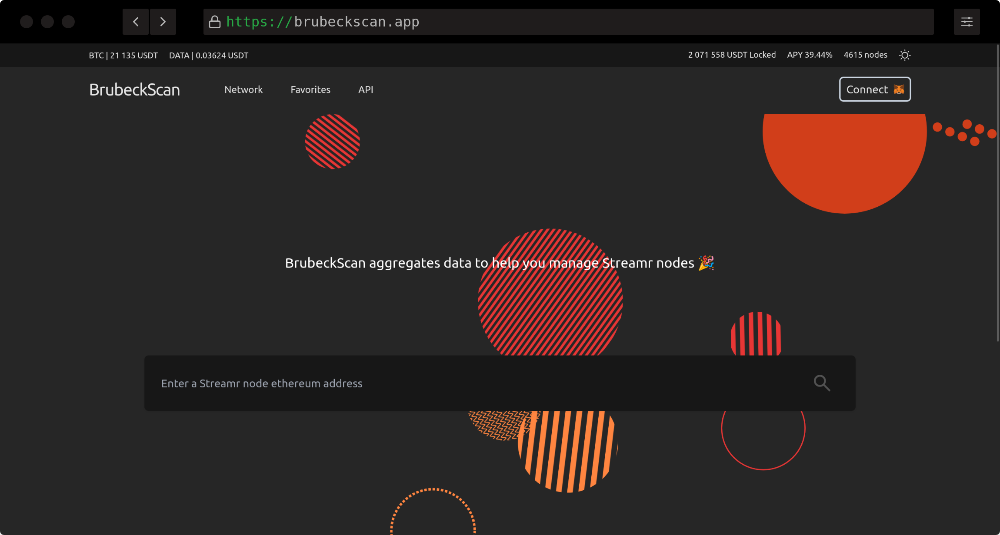

# 
BrubeckScan

      

## Overview

BrubeckScan monorepo

### @brubeckscan/client

- SvelteKit and gateway to main API

### @brubeckscan/server

- Main API

#### Stack

- Node / Express / PrismaORM / socket.io

### @brubeckscan/common

- Types and common utilitaries.

## Public API Routes

- GET api/nodes/[ethereumAddress]

## API Response Format

- [JSend](https://github.com/omniti-labs/jsend)

## Environment

- Node : v18.12.1
